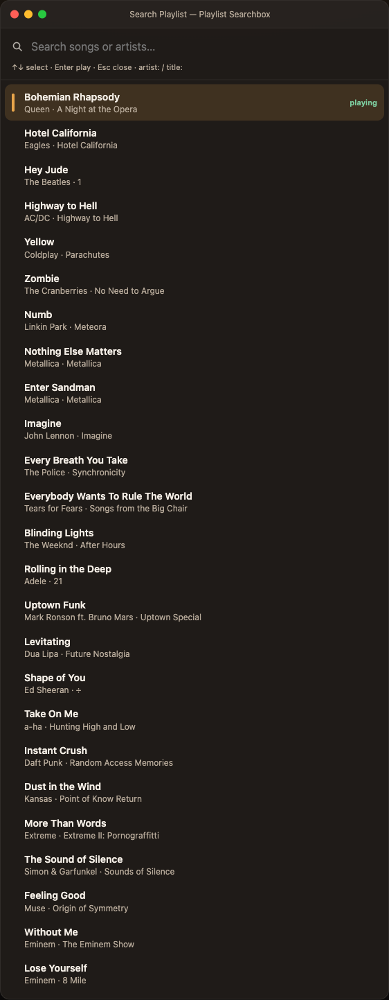
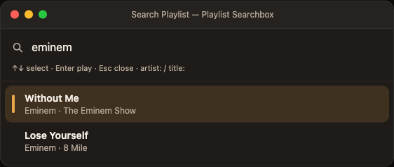

# Playlist Searchbox

A plugin for [IINA](https://iina.io) that adds a fast **title + artist** search box to the current playlist.

Jump to any track in a 800-song folder without scrolling. Type a few letters, pick a row, press Enter.

<p align="center">
  
</p>

<p align="center">
  <a href="https://iina.io"></a>
  <a href="LICENSE"></a>
  <a href="https://github.com/icsarisakal/iina-playlist-searchbox"></a>
</p>

## What it does

IINA’s built-in playlist has no search. This plugin opens a compact palette over the player (including music / mini-player mode) and filters the **open playlist** by:

- song title
- artist
- album
- file name

Prefix a query to lock the field:

| Query | Matches |
| --- | --- |
| `yellow` | title, artist, or file name |
| `artist:eminem` | artist only |
| `title:creep` | title only |

<p align="center">
  
</p>

The tracks in these screenshots were taken from a real local library: Queen, Eagles, The Beatles, AC/DC, Coldplay, The Cranberries, Linkin Park, Metallica, John Lennon, The Police, Tears for Fears, The Weeknd, Adele, Bruno Mars, Dua Lipa, Ed Sheeran, a-ha, Daft Punk, Kansas, Extreme, Simon & Garfunkel, Muse, and Eminem.

## Install

Requires **IINA 1.4 or later**.

### From GitHub (recommended)

1. Open **IINA → Settings → Plugins**
2. Click **Install from GitHub…**
3. Enter: `icsarisakal/iina-playlist-searchbox`
4. Enable the plugin (new plugins start disabled)
5. Restart IINA

### From a packed file

Download the `.iinaplgz` from [Releases](https://github.com/icsarisakal/iina-playlist-searchbox/releases) and open it with IINA, then enable it under **Settings → Plugins**.

## Usage

1. Open a folder or playlist in IINA.
2. Choose **Plugin → Playlist Searchbox → Search Playlist**, or press **⌘F**.
3. Type. Use **↑ / ↓** to move, **Enter** to play, **Esc** to close.

You do **not** have to pre-index a folder. Search opens immediately from file names and any tags already cached. Artist/title tags for tracks that have not played yet are filled in the background (Spotlight `mdls`, then `ffprobe` if installed) and stored so the next search is faster.

## Preferences

**Settings → Plugins → Playlist Searchbox → Preferences**

- **Shortcut** — mpv key syntax, default `Meta+f` (⌘F). Restart IINA after changing it.
- **Metadata** — filename only, Spotlight, or Spotlight + ffprobe.

## How metadata works

IINA’s plugin API does not expose artist tags for unplayed playlist rows. The plugin fills the gap in this order:

1. Playlist / M3U title when present
2. `Artist - Title` file names
3. Tags of the currently playing file (`mpv` metadata)
4. macOS Spotlight (`mdls`)
5. `ffprobe` when it is on your `PATH` (`brew install ffmpeg`)

Results are cached under the plugin data directory. Network URLs are not probed.

## Development

```sh
git clone https://github.com/icsarisakal/iina-playlist-searchbox.git
cd iina-playlist-searchbox
chmod +x install-dev.sh
./install-dev.sh
```

Restart IINA and enable the plugin. After code changes, **Plugin → Reload All Plugins** is enough.

```sh
node test/search.test.js
node test/probe.test.js
/Applications/IINA.app/Contents/MacOS/iina-plugin pack .
```

## License

[MIT](LICENSE)
